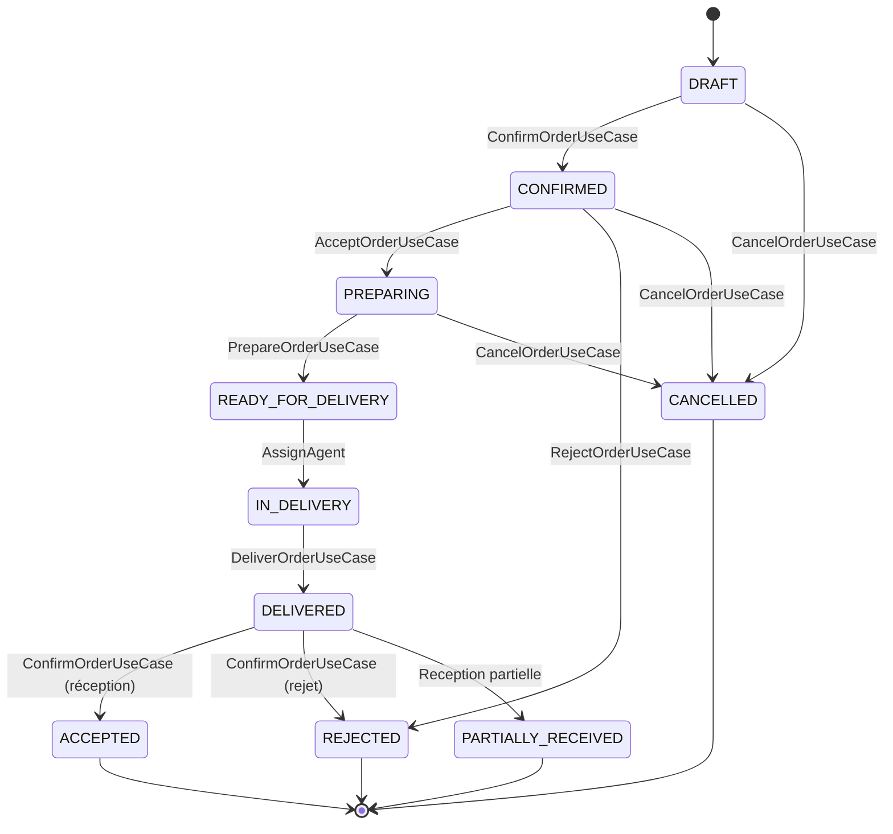
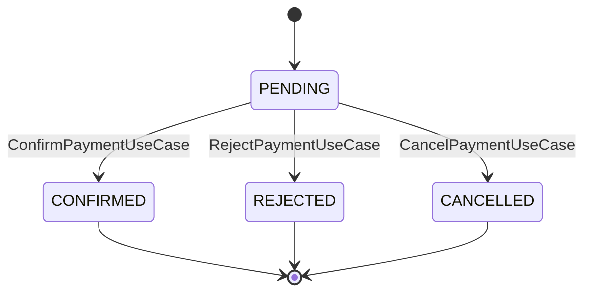
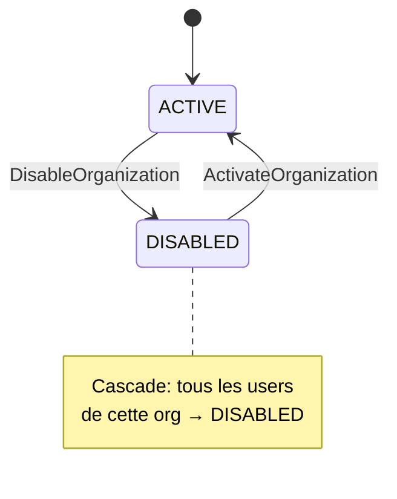
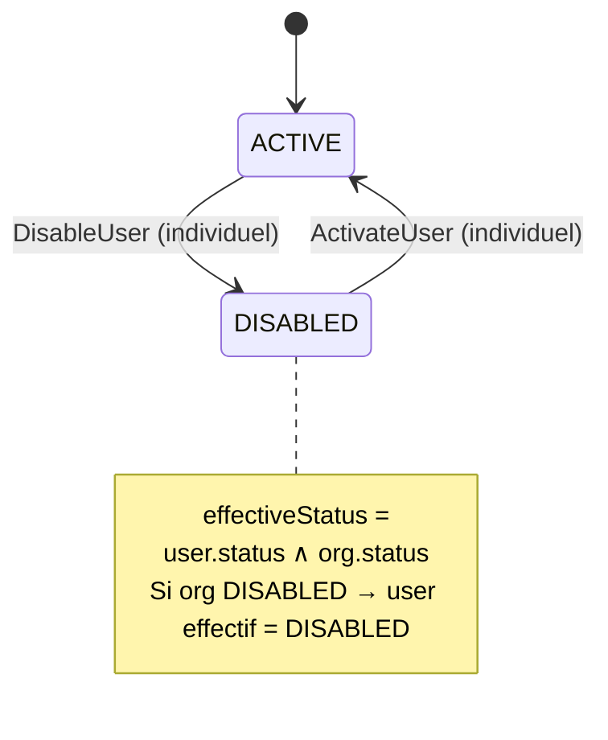
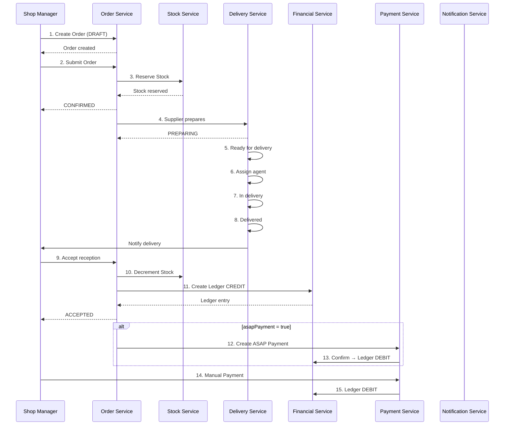

# ANALYSE FONCTIONNELLE & DDD COMPLÈTE — PLATEFORME B2B FOURNISSEUR ↔ BOUTIQUE

> Document de référence pour l'implémentation. Ne pas coder sans avoir validé cette analyse.

---

## TABLE DES MATIÈRES

1. [Vision Globale du Domaine](#1-vision-globale-du-domaine)
2. [Acteurs & Permissions](#2-acteurs--permissions)
3. [Use Cases](#3-use-cases)
4. [Bounded Contexts](#4-bounded-contexts)
5. [Aggregates](#5-aggregates)
6. [Entities](#6-entities)
7. [Value Objects](#7-value-objects)
8. [Domain Events](#8-domain-events)
9. [Machines d'État](#9-machines-détat)
10. [Cycle Complet Order → Delivery → Ledger → Payment](#10-cycle-complet)
11. [Inventory Ledger Model](#11-inventory-ledger-model)
12. [Financial Ledger Model](#12-financial-ledger-model)
13. [Settlement Model](#13-settlement-model)
14. [Customer Abstraction](#14-customer-abstraction)
15. [Pricing Model](#15-pricing-model)
16. [Règles d'Autorisation](#16-règles-dautorisation)
17. [Règles de Cohérence Distribuée](#17-règles-de-cohérence-distribuée)
18. [Scénarios Nominaux](#18-scénarios-nominaux)
19. [Scénarios d'Erreur](#19-scénarios-derreur)
20. [Cas Limites](#20-cas-limites)
21. [Diagrammes Mermaid](#21-diagrammes-mermaid)
22. [Proposition de Découpage Microservices](#22-proposition-de-découpage-microservices)
23. [Recommandations d'Amélioration](#23-recommandations-damélioration)

---

## 1. VISION GLOBALE DU DOMAINE

La plateforme digitalise la relation commerciale B2B entre fournisseurs et boutiques :

```
Organisation
    ↓
Catalogue (Catégorie → Famille → Sous-famille → Produit)
    ↓
Stock (Inventory Ledger : onHand, reserved, available)
    ↓
Commande (DRAFT → CONFIRMED → PREPARING → READY → IN_DELIVERY → DELIVERED → ACCEPTED)
    ↓
Préparation
    ↓
Livraison (Agent assigné)
    ↓
Réception (Acceptée / Refusée / Partielle)
    ↓
Dette / Ledger (ORDER_CREDIT = shop doit au supplier)
    ↓
Paiement (CASH / BANK_TRANSFER / ASAP / PARTIAL)
    ↓
Rapprochement (Reconciliation)
```

---

## 2. ACTEURS & PERMISSIONS

### 2.1. SYSTEM_ADMIN
- **Scope** : Global (pas d'organisation, `organizationId = null`)
- **Permissions** :
  - `ADMIN_MANAGE_ORGANIZATIONS` — Créer/désactiver/réactiver suppliers et shops
  - `ADMIN_MANAGE_USERS` — Créer/désactiver/réactiver n'importe quel utilisateur
  - `ADMIN_VIEW_AUDIT` — Consulter les logs d'audit
  - `ADMIN_VIEW_STATS` — Consulter les statistiques globales
  - `VIEW_PAYMENTS` — Voir tous les paiements
  - `VIEW_NOTIFICATIONS` — Voir toutes les notifications

### 2.2. SUPPLIER_ADMIN
- **Scope** : Sa propre organisation uniquement
- **Permissions** :
  - `SUPPLIER_MANAGE_AGENTS` — Créer/désactiver des SUPPLIER_AGENT
  - `SUPPLIER_MANAGE_PAYMENTS` — Confirmer/refuser les paiements entrants
  - `VIEW_PAYMENTS` — Voir les paiements liés à son fournisseur
  - `VIEW_NOTIFICATIONS` — Voir ses notifications
  - Gestion catalogue, stock, commandes, livraisons

### 2.3. SUPPLIER_AGENT
- **Scope** : Sa propre organisation uniquement
- **Permissions** :
  - `SUPPLIER_MANAGE_PAYMENTS` — Confirmer/refuser les paiements
  - `VIEW_PAYMENTS` — Voir les paiements liés
  - `VIEW_NOTIFICATIONS` — Voir ses notifications
  - Gestion stock (lecture + mouvements)
  - Consultation catalogue (lecture seule)
  - **Ne peut PAS** : créer des utilisateurs, gérer des agents

### 2.4. SHOP_MANAGER
- **Scope** : Sa propre organisation uniquement
- **Permissions** :
  - `SHOP_MANAGE_AGENTS` — Créer/désactiver des SHOP_AGENT
  - `SHOP_CREATE_PAYMENTS` — Créer des paiements vers les fournisseurs
  - `SHOP_CANCEL_PAYMENTS` — Annuler ses paiements en statut PENDING
  - `VIEW_PAYMENTS` — Voir les paiements liés
  - `VIEW_NOTIFICATIONS` — Voir ses notifications
  - Commandes, réception, consultation solde

### 2.5. SHOP_AGENT
- **Scope** : Sa propre organisation uniquement
- **Permissions** :
  - `SHOP_CREATE_PAYMENTS` — Créer des paiements
  - `SHOP_CANCEL_PAYMENTS` — Annuler ses paiements PENDING
  - `VIEW_PAYMENTS` — Voir les paiements liés
  - `VIEW_NOTIFICATIONS` — Voir ses notifications
  - Créer des commandes
  - **Ne peut PAS** : gérer les agents, confirmer les réceptions

---

## 3. USE CASES

### SYSTEM_ADMIN (20 UC)

| # | Action | Résultat |
|---|--------|----------|
| UC-001 | Créer un fournisseur (SUPPLIER) | Org créée ACTIVE, SupplierCreatedEvent |
| UC-002 | Créer une boutique (SHOP) | Org créée ACTIVE, ShopCreatedEvent |
| UC-003 | Désactiver un fournisseur | Org DISABLED + cascade users DISABLED |
| UC-004 | Réactiver un fournisseur | Org ACTIVE (users pas réactivés) |
| UC-005 | Désactiver une boutique | Org DISABLED + cascade users DISABLED |
| UC-006 | Réactiver une boutique | Org ACTIVE |
| UC-007 | Créer un utilisateur (tout rôle) | User créé, UserCreatedEvent |
| UC-008 | Désactiver un utilisateur | User DISABLED, UserDisabledEvent |
| UC-009 | Réactiver un utilisateur | User ACTIVE |
| UC-010 | Lister tous les utilisateurs | Liste paginée avec filtres |
| UC-011 | Consulter statistiques globales | Nombre suppliers, shops, paiements |
| UC-012 | Consulter logs d'audit | Liste paginée avec filtres |
| UC-013 | Consulter un paiement spécifique | Détail (tout paiement plateforme) |
| UC-014 | Lister tous les paiements | Liste paginée avec filtres |
| UC-015 | Consulter relations fournisseur–boutique | Liste des SupplierShopRelation |
| UC-016 | Désactiver une relation | Relation INACTIVE |
| UC-017 | Réactiver une relation | Relation ACTIVE |
| UC-018 | Consulter notifications | Liste non lues/lues |
| UC-019 | Stats paiement par fournisseur | Nombre/montant par supplier |
| UC-020 | Modifier nom d'une organisation | Nom mis à jour, audit tracé |

### SUPPLIER_ADMIN (18 UC)

| # | Action | Résultat |
|---|--------|----------|
| UC-101 | Créer un agent fournisseur | SUPPLIER_AGENT créé |
| UC-102 | Désactiver un agent | Agent DISABLED |
| UC-103 | Réactiver un agent | Agent ACTIVE |
| UC-104 | Confirmer un paiement | PENDING → CONFIRMED, balance créditée |
| UC-105 | Refuser un paiement | PENDING → REJECTED + motif |
| UC-106 | Consulter paiements | Liste paginée |
| UC-107 | Consulter détail paiement | Détail |
| UC-108 | Créer un produit | Produit créé |
| UC-109 | Modifier un produit | Nom, description, prix |
| UC-110 | Supprimer un produit | INACTIVE (soft delete) |
| UC-111 | Ajouter mouvement de stock | StockMovement créé |
| UC-112 | Créer catégorie/famille/sous-famille | Hiérarchie catalogue |
| UC-113 | Créer relation fournisseur–boutique | SupplierShopRelation créée |
| UC-114 | Consulter boutiques associées | Liste des boutiques |
| UC-115 | Accepter une commande | CONFIRMED → PREPARING, stock réservé |
| UC-116 | Refuser une commande | CONFIRMED → REJECTED |
| UC-117 | Marquer commande prête | PREPARING → READY_FOR_DELIVERY |
| UC-118 | Consulter balance | Solde par boutique |

### SUPPLIER_AGENT (12 UC)

| # | Action | Résultat |
|---|--------|----------|
| UC-201 | Confirmer un paiement | PENDING → CONFIRMED |
| UC-202 | Refuser un paiement | PENDING → REJECTED |
| UC-203 | Consulter paiements | Liste paginée |
| UC-204 | Consulter détail paiement | Détail |
| UC-205 | Ajouter mouvement de stock | StockMovement créé |
| UC-206 | Consulter mouvements stock | Liste paginée |
| UC-207 | Consulter catalogue | Liste produits (lecture) |
| UC-208 | Consulter commandes entrantes | Liste commandes |
| UC-209 | Consulter balance | Solde par boutique |
| UC-210 | Consulter notifications | Notifications |
| UC-211 | Consulter profil | Profil lu |
| UC-212 | Changer mot de passe | Mot de passe mis à jour |

### SHOP_MANAGER (16 UC)

| # | Action | Résultat |
|---|--------|----------|
| UC-301 | Créer un agent boutique | SHOP_AGENT créé |
| UC-302 | Désactiver un agent | Agent DISABLED |
| UC-303 | Créer paiement vers fournisseur | Payment PENDING créé |
| UC-304 | Annuler paiement en cours | PENDING → CANCELLED |
| UC-305 | Consulter paiements | Liste paginée |
| UC-306 | Créer commande vers fournisseur | Commande DRAFT créée |
| UC-307 | Confirmer réception | DELIVERED → ACCEPTED, balance créditée |
| UC-308 | Rejeter réception | DELIVERED → REJECTED, stock restitué |
| UC-309 | Consulter fournisseurs associés | Liste suppliers actifs |
| UC-310 | Consulter catalogue fournisseur | Liste produits |
| UC-311 | Consulter balance | Solde par fournisseur |
| UC-312 | Consulter notifications | Notifications |
| UC-313 | Consulter détail paiement | Détail |
| UC-314 | Annuler commande | DRAFT/CONFIRMED/PREPARING → CANCELLED |
| UC-315 | Consulter détail commande | Détail avec items et events |
| UC-316 | Modifier commande DRAFT | Quantités, notes |

### SHOP_AGENT (13 UC)

| # | Action | Résultat |
|---|--------|----------|
| UC-401 | Créer paiement vers fournisseur | Payment PENDING créé |
| UC-402 | Annuler paiement | PENDING → CANCELLED |
| UC-403 | Consulter paiements | Liste paginée |
| UC-404 | Consulter détail paiement | Détail |
| UC-405 | Créer commande | Commande DRAFT créée |
| UC-406 | Consulter commandes | Liste paginée |
| UC-407 | Consulter détail commande | Détail |
| UC-408 | Consulter catalogue | Liste produits |
| UC-409 | Consulter balance | Solde par fournisseur |
| UC-410 | Consulter notifications | Notifications |
| UC-411 | Consulter profil | Profil lu |
| UC-412 | Changer mot de passe | Mot de passe mis à jour |
| UC-413 | Consulter fournisseurs associés | Liste suppliers actifs |

---

## 4. BOUNDED CONTEXTS

| Contexte | Propriétaire | Justification |
|----------|-------------|---------------|
| **Identity** | User, Role, Session, JWT | Sécurité distincte de la logique métier |
| **Organization** | Org, Catalog, Stock, Order, Delivery, Reception, Debt, Ledger, Reconciliation | Domaine opérationnel central — cycle B2B complet |
| **Payment** | Payment, PaymentEvent | Exigences réglementaires/audit, optimistic locking |
| **Notification** | Notification | Logique transversale de routage, isolée du domaine |

```
┌─────────────────────┐    ┌─────────────────────┐    ┌─────────────────────┐
│    IDENTITY BC       │    │  ORGANIZATION BC     │    │    PAYMENT BC       │
│                     │    │                     │    │                     │
│  User (AR)          │    │  Organization (AR)   │    │  Payment (AR)       │
│  RoleCode           │    │  SupplierShopRel.(E) │    │  PaymentStatus      │
│  Email, Username    │    │  Order (E)           │    │  Money (VO)         │
│  PasswordHash       │    │  OrderItem (E)       │    │  PaymentReference   │
│                     │    │  Product (E)         │    │                     │
│                     │    │  StockMovement (E)   │    │                     │
│                     │    │  BalanceEntry (E)    │    │                     │
│                     │    │  ProductCategory(E)  │    │                     │
│                     │    │  ProductFamily (E)   │    │                     │
│                     │    │  ProductSubfamily(E) │    │                     │
└─────────────────────┘    └─────────────────────┘    └─────────────────────┘
          │                         │                         │
          └────────── RabbitMQ ─────┴────────── RabbitMQ ─────┘
                     (Outbox Pattern)
                           │
                    ┌──────▼──────┐
                    │ NOTIFICATION │
                    │     BC       │
                    └─────────────┘
```

---

## 5. AGGREGATES (15)

| # | Aggregate Root | Entities | Value Objects | Invariants |
|---|---------------|----------|---------------|------------|
| 1 | **Organization** | SupplierShopRelation | OrganizationId, Name, Type, Status, Address | Un supplier ne peut être lié à lui-même |
| 2 | **User** | UserRole | UserId, Username, Email, PasswordHash, PhoneNumber | effectiveStatus = user.ACTIVE ∧ org.ACTIVE |
| 3 | **ProductCatalog** | ProductCategory, ProductFamily, ProductSubfamily | CatalogId | Hiérarchie: Cat→Fam→Sous-fam |
| 4 | **Product** | — | Sku, UnitPrice, ProductStatus | SKU unique par supplier, quantité ≥ 0 |
| 5 | **Stock** | StockMovement, StockReservation | StockLevel (onHand, reserved, available) | available = onHand - reserved ≥ 0 |
| 6 | **Order** | OrderItem, OrderEvent | OrderReference, OrderStatus | Prix snapshot figé, total = somme lignes |
| 7 | **Delivery** | — | DeliveryAgentId, deliveredAt | Assigné depuis READY_FOR_DELIVERY |
| 8 | **Reception** | ReceptionItem | receivedBy | Quantités réelles ≤ quantités livrées |
| 9 | **DebtEntry** | — | DebtEntryType | CRÉDIT = shop doit, DÉBIT = shop paie |
| 10 | **Ledger** | BalanceEntry | LedgerEntryType | Append-only, jamais modifié |
| 11 | **Payment** | PaymentEvent | PaymentReference, PaymentStatus | terminal = {CONFIRMED, REJECTED, CANCELLED} |
| 12 | **Settlement** | PaymentAllocation | PaymentTerm, SettlementPaymentStatus | paidAmount ≤ totalAmount |
| 13 | **Reconciliation** | ReconciliationCheck | DiscrepancyType | Détecte écarts order/delivery/payment |
| 14 | **AuditLog** | — | AuditAction | Toute action sensible tracée |
| 15 | **Notification** | — | ReadStatus | Persistée + temps réel |

---

## 6. ENTITIES (23)

| # | Entity | Aggregate | Attributs Clés | Lifecycle |
|---|--------|-----------|----------------|-----------|
| 1 | User | User | id, username, email, passwordHash, firstName, lastName, phone, organizationId, status | Créé → ACTIVE/DISABLED |
| 2 | UserRole | User | userId, roleCode | Lié à User |
| 3 | Organization | Organization | id, name, type, status | Créé → ACTIVE/DISABLED |
| 4 | SupplierShopRelation | Organization | id, supplierId, shopId, status | Créé → ACTIVE/INACTIVE |
| 5 | ProductCategory | ProductCatalog | id, supplierId, name, code, status | Créé → ACTIVE |
| 6 | ProductFamily | ProductCatalog | id, supplierId, categoryId, name, code, status | Créé → ACTIVE |
| 7 | ProductSubfamily | ProductCatalog | id, supplierId, familyId, name, code, status | Créé → ACTIVE |
| 8 | Product | Product | id, supplierId, name, sku, unitPrice, quantity, reservedQty, status | Créé → ACTIVE/INACTIVE |
| 9 | StockMovement | Stock | id, productId, supplierId, type, quantity, previousQty, newQty | Append-only |
| 10 | StockReservation | Stock | id, productId, orderId, quantity | Créé → RELEASED/CONSUMED |
| 11 | Order | Order | id, reference, supplierId, shopId, source, status, total, currency | DRAFT → ... → ACCEPTED |
| 12 | OrderItem | Order | id, orderId, productId, productName, quantity, unitPrice, discount, total | Snapshot figé |
| 13 | OrderEvent | Order | id, orderId, action, userId, timestamp | Append-only |
| 14 | Reception | Delivery | id, orderId, receivedBy, receivedAt | Créé à la réception |
| 15 | ReceptionItem | Delivery | id, receptionId, productId, orderedQty, receivedQty, status | ACCEPTED/REJECTED |
| 16 | DebtEntry | DebtEntry | id, supplierId, shopId, type, amount, orderId | Append-only |
| 17 | BalanceEntry | Ledger | id, supplierId, shopId, type, amount, balanceAfter, orderId, paymentId | Append-only |
| 18 | Payment | Payment | id, reference, shopId, supplierId, amount, currency, status | PENDING → terminal |
| 19 | PaymentEvent | Payment | id, paymentId, action, userId, timestamp | Append-only |
| 20 | Settlement | Settlement | id, supplierId, shopId, orderId, totalAmount, paidAmount, dueDate, status | UNPAID → PAID |
| 21 | PaymentAllocation | Settlement | id, settlementId, paymentId, allocatedAmount | Lié à Settlement |
| 22 | ReconciliationCheck | Reconciliation | id, orderId, scope, result, discrepancyType | CLEAN/DISCREPANCY |
| 23 | Notification | Notification | id, recipientUserId, type, message, readStatus | Créé → lu |

---

## 7. VALUE OBJECTS (26)

| # | Value Object | Attributs | Validation |
|---|-------------|-----------|------------|
| 1 | UserId | value: Long | > 0 |
| 2 | Username | value: String | 3-50 chars, unique |
| 3 | Email | value: String | Format email, unique |
| 4 | PasswordHash | value: String | BCrypt, 60 chars |
| 5 | PhoneNumber | value: String | Optional, format +216 |
| 6 | OrganizationId | value: Long | > 0 |
| 7 | OrganizationName | value: String | 2-100 chars |
| 8 | OrganizationType | value: SUPPLIER \| SHOP | Enum |
| 9 | OrganizationStatus | value: ACTIVE \| DISABLED | Enum |
| 10 | Address | street, city, zip, country | Non vide |
| 11 | TaxIdentifier | value: String | Optionnel |
| 12 | Currency | value: String | ISO 4217 (TND, EUR, USD) |
| 13 | Money | amount: BigDecimal, currency: Currency | amount > 0 |
| 14 | OrderReference | value: String | Auto-généré, unique |
| 15 | OrderStatus | value: DRAFT→...→ACCEPTED | Enum avec transitions |
| 16 | RejectionReason | value: String | Non vide quand rejection |
| 17 | ProductStatus | value: ACTIVE \| INACTIVE | Enum |
| 18 | Sku | value: String | Unique par supplier |
| 19 | UnitPrice | value: BigDecimal | ≥ 0 |
| 20 | PaymentId | value: Long | > 0 |
| 21 | PaymentReference | value: String | Auto-généré, unique |
| 22 | PaymentStatus | value: PENDING→CONFIRMED/REJECTED/CANCELLED | Enum |
| 23 | ReadStatus | value: UNREAD \| READ | Enum |
| 24 | RoleCode | value: SYSTEM_ADMIN→SHOP_AGENT | Enum |
| 25 | AuditAction | value: String | Constantes prédéfinies |
| 26 | UserStatus | value: ACTIVE \| DISABLED | Enum |

---

## 8. DOMAIN EVENTS (30)

| # | Event | Aggregate | Payload | Déclencheur |
|---|-------|-----------|---------|-------------|
| DE-001 | SupplierCreatedEvent | Organization | organizationId, name | CreateOrganizationUseCase |
| DE-002 | SupplierActivatedEvent | Organization | organizationId | OrganizationStatusUseCase.activate |
| DE-003 | SupplierDisabledEvent | Organization | organizationId | OrganizationStatusUseCase.disable |
| DE-004 | ShopCreatedEvent | Organization | organizationId, name | CreateOrganizationUseCase |
| DE-005 | ShopActivatedEvent | Organization | organizationId | OrganizationStatusUseCase.activate |
| DE-006 | ShopDisabledEvent | Organization | organizationId | OrganizationStatusUseCase.disable |
| DE-007 | UserCreatedEvent | User | userId, organizationId, roles[] | RegisterUseCase / InternalUserCreationUseCase |
| DE-008 | UserActivatedEvent | User | userId, organizationId | UserStatusUseCase.activate |
| DE-009 | UserDisabledEvent | User | userId, organizationId, reason | UserStatusUseCase.disable |
| DE-010 | PaymentCreatedEvent | Payment | paymentId, reference, shopId, supplierId, amount, currency | CreatePaymentUseCase |
| DE-011 | PaymentConfirmedEvent | Payment | paymentId, reference, shopId, supplierId | ConfirmPaymentUseCase |
| DE-012 | PaymentRejectedEvent | Payment | paymentId, reference, rejectionReason | RejectPaymentUseCase |
| DE-013 | PaymentCancelledEvent | Payment | paymentId, reference, shopId, supplierId | CancelPaymentUseCase |
| DE-014 | OrderCreatedEvent | Order | orderId, reference, supplierId, shopId, total | CreateOrderUseCase |
| DE-015 | OrderConfirmedEvent | Order | orderId, reference, supplierId, shopId | ConfirmOrderUseCase |
| DE-016 | OrderPreparingEvent | Order | orderId, reference, supplierId, shopId | AcceptOrderUseCase |
| DE-017 | OrderReadyForDeliveryEvent | Order | orderId, reference, deliveryAgentId | PrepareOrderUseCase |
| DE-018 | OrderInDeliveryEvent | Order | orderId, reference, deliveryAgentId | Transition IN_DELIVERY |
| DE-019 | OrderDeliveredEvent | Order | orderId, reference, receivedBy, deliveredAt | DeliverOrderUseCase |
| DE-020 | OrderAcceptedEvent | Order | orderId, reference, acceptedBy | ConfirmOrderUseCase (réception) |
| DE-021 | OrderRejectedEvent | Order | orderId, reference, rejectedBy, reason | ConfirmOrderUseCase (rejet) |
| DE-022 | OrderCancelledEvent | Order | orderId, reference, cancelledBy | CancelOrderUseCase |
| DE-023 | StockAdjustedEvent | Product | productId, previousQty, newQty, type | StockService |
| DE-024 | StockReservedEvent | Product | productId, reservedQty, orderId | AcceptOrderUseCase |
| DE-025 | StockReleasedEvent | Product | productId, releasedQty, orderId | CancelOrderUseCase |
| DE-026 | BalanceDebitedEvent | BalanceEntry | supplierId, shopId, amount, balanceAfter | OrderAcceptedEvent handler |
| DE-027 | BalanceCreditedEvent | BalanceEntry | supplierId, shopId, amount, balanceAfter | PaymentConfirmedEvent handler |
| DE-028 | RelationCreatedEvent | SupplierShopRelation | supplierId, shopId | SupplierShopRelationUseCase.create |
| DE-029 | RelationDeactivatedEvent | SupplierShopRelation | supplierId, shopId | SupplierShopRelationUseCase.deactivate |
| DE-030 | NotificationCreatedEvent | Notification | recipientId, type, message | Consommateur d'événements métier |

---

## 9. MACHINES D'ÉTAT

### 9.1. OrderStatus



### 9.2. PaymentStatus



### 9.3. OrganizationStatus



### 9.4. UserStatus (effective)



---

## 10. CYCLE COMPLET

### 10.1. Flux Nominal



### 10.2. Tableau des Changements d'État

| Étape | Action | Order Status | Stock | Financial | Settlement |
|-------|--------|-------------|-------|-----------|------------|
| 1 | Création commande | DRAFT | — | — | — |
| 2 | Soumission | CONFIRMED | RESERVATION (+qty) | — | — |
| 3 | Préparation | PREPARING | — | — | — |
| 4 | Prête | READY_FOR_DELIVERY | — | — | — |
| 5 | Agent assigné | IN_DELIVERY | — | — | — |
| 6 | Livrée | DELIVERED | — | — | — |
| 7 | Acceptée | ACCEPTED | DECREMENT (-qty) | ORDER_CREDIT (+total) | Created (UNPAID) |
| 8 | Paiement 1 | — | — | PAYMENT_DEBIT (-amount) | PARTIALLY_PAID |
| 9 | Paiement final | — | — | PAYMENT_DEBIT (-amount) | PAID |
| 10 | Rapprochement | — | — | — | CLEAN |

---

## 11. INVENTORY LEDGER MODEL

### 11.1. Types de Mouvements

| Type | Description | Impact onHand | Impact reserved |
|------|-------------|---------------|-----------------|
| STOCK_IN | Restock manuel | +qty | — |
| STOCK_OUT | Retrait manuel | -qty | — |
| RESERVATION | Commande confirmée | — | +qty |
| RELEASE | Commande annulée | — | -qty |
| DECREMENT | Livraison acceptée | -qty | -qty |
| RETURN | Retour client | +qty | — |
| ADJUSTMENT | Correction | ±qty | — |

### 11.2. Formules

```
onHand   = stock physique en entrepôt
reserved = unités engagées (commandes CONFIRMED/PREPARING, pas encore livrées)
available = onHand - reserved

Exemple :
  onHand = 100
  reserved = 20 (commande A × 10 + commande B × 10)
  available = 80

Réservation de 5 :
  reserved = 25
  available = 75

Livraison acceptée (DECREMENT) de 10 :
  onHand = 90
  reserved = 15
  available = 75
```

### 11.3. Concurrency Handling

```java
// SELECT ... FOR UPDATE sur la ligne StockLevel
// Empêche deux réservations simultanées de dépasser le stock
StockLevel level = stockLevels
    .findByProductIdAndSupplierIdForUpdate(productId, supplierId);

if (level.getAvailable() < requestedQty) {
    throw new ConflictException("Stock insuffisant");
}

level.setReserved(level.getReserved() + requestedQty);
level.setAvailable(level.getOnHand() - level.getReserved());
```

---

## 12. FINANCIAL LEDGER MODEL

### 12.1. Sens du Ledger

```
CRÉDIT (+) = montant dû par la boutique au fournisseur
  → Commande acceptée = ORDER_CREDIT

DÉBIT (-) = montant payé par la boutique
  → Paiement confirmé = PAYMENT_DEBIT
```

### 12.2. Balance

```
balance = SUM(ORDER_CREDIT) - SUM(PAYMENT_DEBIT) + SUM(ADJUSTMENT)

balance POSITIVE = shop DOIT au supplier
balance NÉGATIVE = shop a AVANCÉ (avoir)
```

### 12.3. Règles

- **Immuable** : jamais modifier/supprimer une entrée
- **Correction** : créer un mouvement ADJUSTMENT
- **Append-only** : journal financier fiable pour audit
- **Multi-device** : chaque paire (supplier, shop, currency)

---

## 13. SETTLEMENT MODEL

### 13.1. Conditions de Règlement

| Terme | Jours | Exemple |
|-------|-------|---------|
| IMMEDIATE | 0 | Paiement à la réception |
| NET_7 | 7 | Échéance = réception + 7 jours |
| NET_15 | 15 | Échéance = réception + 15 jours |
| NET_30 | 30 | Échéance = réception + 30 jours |
| NET_60 | 60 | Échéance = réception + 60 jours |

### 13.2. Paiements Partiels

```
Settlement : totalAmount = 5000 TND, paidAmount = 0, status = UNPAID
Paiement 1 : 2000 TND → paidAmount = 2000, status = PARTIALLY_PAID
Paiement 2 : 3000 TND → paidAmount = 5000, status = PAID
```

### 13.3. Paiement ASAP

```
Order ACCEPTED (asapPayment = true)
    → Création automatique Payment PENDING
    → Confirmation → Ledger DEBIT
    → Idempotent : 1 seule commande = 1 seul paiement ASAP
```

---

## 14. CUSTOMER ABSTRACTION

```java
enum CustomerType {
    SHOP,               // Boutique enregistrée sur la plateforme
    EXTERNAL_CUSTOMER   // Client externe / B2C / extensibilité future
}
```

- **SHOP** : référence polymorphe vers `Organization.id`
- **EXTERNAL_CUSTOMER** : données dénormalisées (nom, email, téléphone)
- **Extensibilité** : permettra plus tard les ventes B2C

---

## 15. PRICING MODEL

### 15.1. Prix Figé dans la Commande

```
Product price = 3.00 TND (aujourd'hui)
Order created at 2.80 TND → OrderItem.unitPrice = 2.80 (jamais recalculé)
Product price changé à 3.50 TND → les anciennes commandes restent à 2.80
```

### 15.2. Calcul

```
discountAmount = catalogPrice × discountRate / 100
netUnitPrice = catalogPrice - discountAmount
lineSubtotal = netUnitPrice × quantity
lineTax = lineSubtotal × taxRate / 100
lineTotal = lineSubtotal + lineTax
orderTotal = SUM(lineTotal)
```

---

## 16. RÈGLES D'AUTORISATION

| # | Règle | Enforcement |
|---|-------|-------------|
| R-001 | Statut effectif = user.ACTIVE ∧ org.ACTIVE | Login, JWT filter |
| R-002 | Cascade désactivation org → tous les users | OrganizationEventConsumer |
| R-003 | Réactivation org ≠ réactivation users | UserStatusUseCase |
| R-004 | Scope multi-tenant par JWT orgId | Chaque use case |
| R-005 | Relation active requise pour paiement | CreatePaymentUseCase |
| R-006 | Machine états paiement contrôlée | PaymentStatus.assertCanTransitionTo |
| R-007 | Rejet exige motif | Payment.reject |
| R-008 | Optimistic locking paiement | @Version |
| R-009 | Password BCrypt, pas en clair | PasswordConfig |
| R-010 | JWT expiration 30 min | JwtAuthenticationFilter |
| R-011 | Un seul paiement ASAP par commande | Idempotency key |
| R-012 | Doublon relation interdit | Contrainte unique |
| R-013 | Auto-relation interdite | supplierId ≠ shopId |
| R-014 | Stock ≥ 0 toujours | StockService validation |

---

## 17. RÈGLES DE COHÉRENCE DISTRIBUTUÉE

| # | Règle | Mécanisme |
|---|-------|-----------|
| C-001 | Réservation atomique du stock | SELECT FOR UPDATE |
| C-002 | Double confirmation paiement | Optimistic locking (@Version) |
| C-003 | Événements non perdus | Outbox pattern |
| C-004 | Consommateur idempotent | Table processed_events |
| C-005 | Opérations idempotentes | Idempotency keys |
| C-006 | Paiement double | Contrainte unique settlement+payment |
| C-007 | Prix figé dans commande | Snapshot dans OrderItem |
| C-008 | Ledger immuable | Append-only, jamais UPDATE/DELETE |

---

## 18. SCÉNARIOS NOMINAUX

### SN-01 : Commande → Livraison → Paiement (asapPayment = false)
1. SHOP_AGENT crée commande → DRAFT
2. SHOP_MANAGER confirme → CONFIRMED, stock réservé
3. SUPPLIER_ADMIN accepte → PREPARING
4. SUPPLIER_ADMIN marque prête → READY_FOR_DELIVERY, agent assigné
5. Agent livre → IN_DELIVERY → DELIVERED
6. SHOP_MANAGER accepte réception → ACCEPTED, stock décrémenté, balance débitée
7. SHOP_AGENT crée paiement → PENDING
8. SUPPLIER_AGENT confirme paiement → CONFIRMED, balance créditée

### SN-02 : Commande ASAP
- Même flux jusqu'à ACCEPTED
- Paiement automatique créé → PENDING
- Confirmation → CONFIRMED, balance créditée

### SN-03 : Désactivation cascade fournisseur
1. SYSTEM_ADMIN désactive fournisseur → Org DISABLED
2. Tous les users SUPPLIER_* → DISABLED
3. Login refusé, JWT rejeté

### SN-04 : Création catalogue
1. Catégorie → Famille → Sous-famille → Produit
2. Mouvement IN → stock ajusté

### SN-05 : Rejet réception → re-livraison
1. SHOP_MANAGER rejette → DELIVERY_REJECTED
2. Stock restitué (RELEASE)
3. SUPPLIER_ADMIN relance → CONFIRMED
4. Flux reprend

---

## 19. SCÉNARIOS D'ERREUR

| # | Scénario | Résultat |
|---|----------|----------|
| SE-01 | Paiement sans relation active | 422 "Aucune relation active" |
| SE-02 | Double confirmation simultanée | 409 OptimisticLockException |
| SE-03 | Modification paiement terminal | 422 "État terminal" |
| SE-04 | Désactivation user déjà DISABLED | 200 (idempotent) |
| SE-05 | Annulation commande DELIVERED | 409 "Transition invalide" |
| SE-06 | Stock insuffisant mouvement OUT | 422 "Stock insuffisant" |
| SE-07 | Login org désactivée | 401 "Organisation désactivée" |
| SE-08 | Relation duplicate | 409 "Relation active existe déjà" |
| SE-09 | Agent non autorisé | 403 Forbidden |
| SE-10 | Produit INACTIVE dans commande | 422 "Produit non disponible" |

---

## 20. CAS LIMITES

| # | Cas | Règle |
|---|-----|-------|
| CL-01 | Produit INACTIVE dans commandes en cours | Soft delete, commandes conservent le snapshot |
| CL-02 | Réactivation org ≠ réactivation users | Users restent DISABLED |
| CL-03 | Paiement montant ≤ 0 | Validation amount > 0 requise |
| CL-04 | Commande sans items | Validation items.size > 0 requise |
| CL-05 | Changement prix pendant commande | Prix snapshot figé |
| CL-06 | Double paiement ASAP | Contrainte idempotency requise |
| CL-07 | Relation avec org DISABLED | Vérifier status org dans use case |
| CL-08 | Concurrence réservation stock | SELECT FOR UPDATE requis |
| CL-09 | ADJUSTMENT quantité négative | Valider type vs signe |
| CL-10 | Réception partielle | Gérer PARTIALLY_RECEIVED |

---

## 21. DIAGRAMMES MERMAID

Voir sections 9.1 à 9.4 pour les diagrammes d'état.
Voir section 10.1 pour le diagramme de séquence.

---

## 22. PROPOSITION DE DÉCOUPAGE MICROSERVICES

| Service | Bounded Context | Base de Données | Port |
|---------|----------------|-----------------|------|
| **identity-service** | Identity | identity_db | 8081 |
| **organization-service** | Organization + Catalog + Stock + Order + Delivery + Ledger + Reconciliation | organization_db | 8082 |
| **payment-service** | Payment + Settlement | payment_db | 8083 |
| **notification-service** | Notification | notification_db | 8084 |
| **api-gateway** | Routing, Security | — | 8080 |

### Justification du regroupement Organization
L'Organization BC regroupe Catalog, Stock, Order, Delivery, Ledger car :
- Ces domaines partagent le même aggregate racine (Organization)
- Les opérations sont fortement cohérentes transactionnellement
- Séparer ces domaines en microservices distincts créerait une complexité de cohérence distribuée inutile pour un MVP
- Le ledger et les commandes sont intimement liés (OrderAccepted → LedgerCredit)

### Communication

```
REST (synchrone) :
  Angular → API Gateway → Services
  Service → Service (validation, queries)

Events (asynchrone via RabbitMQ) :
  organization-service → payment-service (OrderAccepted → create payment)
  payment-service → organization-service (PaymentConfirmed → update balance)
  Tout service → notification-service ( événements → notifications)
```

---

## 23. RECOMMANDATIONS D'AMÉLIORATION

### Bugs identifiés dans le code actuel

| # | Issue | Priorité | Impact |
|---|-------|----------|--------|
| 1 | Pas de validation `amount > 0` dans Payment.create() | HAUTE | Paiement de 0 TND possible |
| 2 | Pas de validation `items.size() > 0` dans CreateOrderUseCase | HAUTE | Commande vide possible |
| 3 | Pas de vérification `org.status = ACTIVE` pour relation shop/supplier | MOYENNE | Relation avec org DISABLED |
| 4 | Pas de contrainte "un seul paiement par commande ASAP" | HAUTE | Double paiement |
| 5 | Pas de locking atomique du stock | HAUTE | Dépassement stock concurrent |
| 6 | `receivedAt` jamais renseigné dans Order | BASSÉ | Donnée manquante |
| 7 | Événements manquants : ProductCreated, OrderCancelled | BASSÉ | Audit incomplet |
| 8 | Frontend incomplet : routes supplier/orders, shop/balance | MOYENNE | UX incomplète |

### Actions recommandées

1. **Immédiat** : Corriger les validations manquantes (items, amount, org status)
2. **Court terme** : Implémenter SELECT FOR UPDATE pour le stock
3. **Moyen terme** : Ajouter la couche Settlement pour le suivi des échéances
4. **Long terme** : Implémenter la réconciliation automatique
