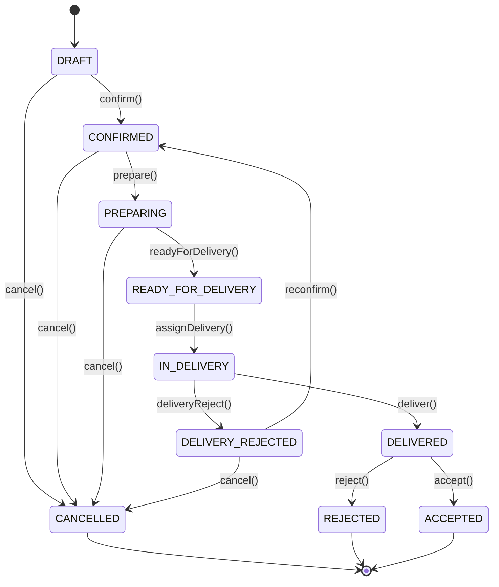
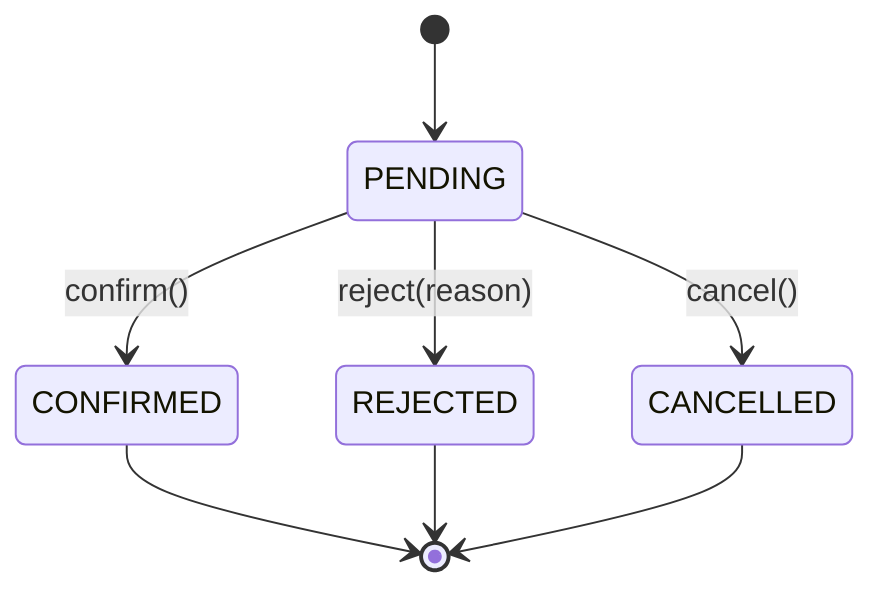
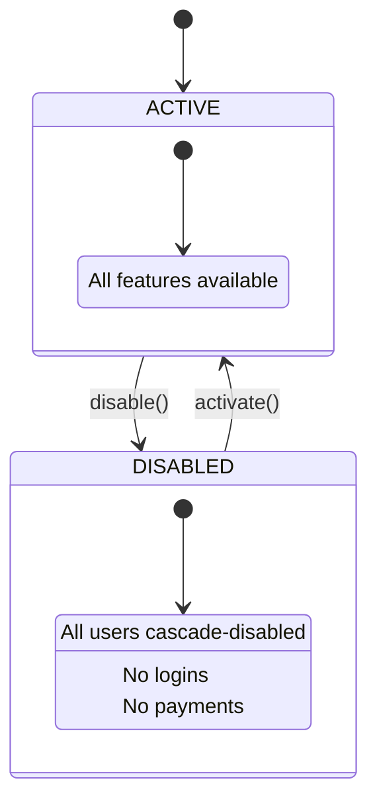
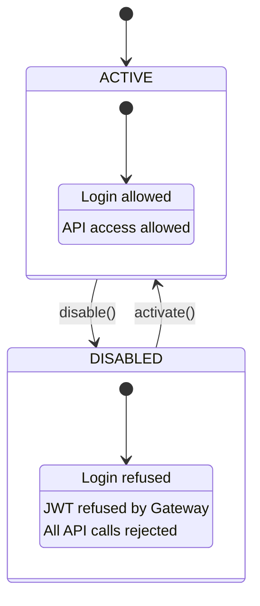

# Complete Domain Model — B2B Payment Platform

> Reference: `docs/domain-model-complete.md`
> Covers: Organisation → Catalogue → Stock → Commande → Préparation → Livraison → Réception → Dette/Ledger → Paiement → Rapprochement

---

## 1. Bounded Contexts

### 1.1 Identity Context

**Responsibility:** Authentication, authorization, user lifecycle, role/permission management.

**Owns:** `User`, `Role`, `Permission`, `Session`, `JWT`

**Public Interface:**
- `POST /auth/login`, `POST /auth/logout`
- `POST /users`, `PATCH /users/{id}/status`, `GET /users/{id}`
- `GET /users?organizationId={id}`
- Consumes: `OrganizationDisabledEvent`, `OrganizationActivatedEvent`

**Justification:** Separated because user credentials, password hashing, and session management have distinct security constraints. Never exposed outside auth flows. Anti-corruption: never leaks user model to other contexts — only emits `UserId` + `UserStatus`.

---

### 1.2 Organization Context

**Responsibility:** Supplier/Shop lifecycle, catalog, stock, orders, preparation, delivery, reception, ledger, reconciliation. This is the **core domain** — the largest bounded context, owning the entire B2B transaction lifecycle.

**Owns:** `Organization`, `SupplierShopRelation`, `ProductCatalog`, `Product`, `Stock`, `Order`, `OrderItem`, `OrderEvent`, `Delivery`, `Reception`, `DebtEntry`, `BalanceEntry`, `ReconciliationEntry`

**Public Interface:**
- `POST /organizations`, `PATCH /organizations/{id}/status`
- `POST /relations`, `GET /relations?supplierId={id}`
- `POST /catalogs/{catalogId}/products`, `GET /products?supplierId={id}`
- `POST /stocks/movements`, `GET /stocks?productId={id}`
- `POST /orders`, `PATCH /orders/{id}/status`, `GET /orders/{id}`
- `POST /orders/{id}/deliveries`, `PATCH /deliveries/{id}/status`
- `POST /orders/{id}/receptions`, `GET /receptions?orderId={id}`
- `GET /ledger?shopId={id}&supplierId={id}`
- `GET /reconciliation?supplierId={id}`
- Emits: `OrderCreatedEvent`, `OrderConfirmedEvent`, `OrderDeliveredEvent`, `OrderAcceptedEvent`, `StockReservedEvent`, `StockReleasedEvent`, `DebtCreatedEvent`, `PaymentRequestedEvent`
- Consumes: `PaymentConfirmedEvent`, `PaymentRejectedEvent`, `PaymentCancelledEvent`

**Justification:** All operational steps from catalog browsing through reconciliation share the same aggregate boundaries and transactional consistency requirements. Splitting into multiple contexts would require cross-service orchestration for a single order lifecycle. The organization context is the operational backbone. Anti-corruption: Payment Context never sees Product/Stock/Order model — only sees `PaymentId`, `OrderId`, `Money`.

---

### 1.3 Payment Context

**Responsibility:** Payment processing, confirmation/rejection workflow, payment audit trail.

**Owns:** `Payment`, `PaymentEvent`

**Public Interface:**
- `POST /payments`, `PATCH /payments/{id}/status` (confirm/reject/cancel)
- `GET /payments?supplierId={id}`, `GET /payments/{id}`
- Consumes: `OrderAcceptedEvent`, `DebtCreatedEvent`
- Emits: `PaymentCreatedEvent`, `PaymentConfirmedEvent`, `PaymentRejectedEvent`, `PaymentCancelledEvent`

**Justification:** Payment processing has distinct regulatory, security, and audit requirements. Optimistic locking (`@Version`) prevents double-confirmation. Anti-corruption: Payment never accesses Organization/Identity models directly — only verifies status via synchronous calls at creation time.

---

### 1.4 Notification Context

**Responsibility:** Real-time and persisted notifications for all platform events.

**Owns:** `Notification`

**Public Interface:**
- `GET /notifications?userId={id}&status={unread|all}`
- `PATCH /notifications/{id}/read`
- `GET /notifications/stream?userId={id}` (SSE)
- Consumes: All `*Event` types from all contexts

**Justification:** Notification routing logic (who gets notified for which event) is cross-cutting. Isolating it prevents notification concerns from polluting domain logic. Anti-corruption: Notification only knows `UserId`, `OrganizationId`, `NotificationType` — never sees business entity details.

---

## 2. Aggregates (15 total)

### 2.1 `Organization`

| Aspect | Detail |
|---|---|
| **Root Entity** | `Organization` |
| **Entities** | `SupplierShopRelation` |
| **Value Objects** | `OrganizationId`, `OrganizationName`, `OrganizationType`, `OrganizationStatus`, `Address`, `TaxIdentifier` |
| **Invariants** | Name non-empty, ≤100 chars; Type ∈ {SUPPLIER, SHOP}; Status ∈ {ACTIVE, DISABLED}; Disabling an org does NOT reactivate individually-disabled users; SupplierShopRelation is unique per (supplierId, shopId) pair |
| **Repository** | `OrganizationRepository` — `findById(OrganizationId)`, `findByType(OrganizationType)`, `existsByIdAndStatus(OrganizationId, ACTIVE)` |

---

### 2.2 `User`

| Aspect | Detail |
|---|---|
| **Root Entity** | `User` |
| **Entities** | `UserRole` (join with permissions) |
| **Value Objects** | `UserId`, `Username`, `Email`, `PasswordHash`, `PhoneNumber`, `UserStatus`, `RoleCode` |
| **Invariants** | Username unique, 3–50 chars; Email RFC 5322 unique; Password ≥ 60 chars (BCrypt); Status ∈ {ACTIVE, DISABLED}; Role ∈ {SYSTEM_ADMIN, SUPPLIER_ADMIN, SUPPLIER_AGENT, SHOP_ADMIN, SHOP_AGENT}; SYSTEM_ADMIN has organizationId = null; Effective status = user.status AND org.status |
| **Repository** | `UserRepository` — `findById(UserId)`, `findByUsername(Username)`, `findByOrganizationId(OrganizationId)`, `existsByUsernameAndStatus(Username, ACTIVE)` |

---

### 2.3 `ProductCatalog`

| Aspect | Detail |
|---|---|
| **Root Entity** | `ProductCatalog` |
| **Entities** | `ProductCategory`, `ProductFamily`, `ProductSubfamily` |
| **Value Objects** | `CatalogId`, `CatalogName`, `CatalogStatus` |
| **Invariants** | One catalog per supplier; Catalog must be ACTIVE to add products; Categories have unique names within a catalog; Families belong to exactly one category; Subfamilies belong to exactly one family |
| **Repository** | `ProductCatalogRepository` — `findById(CatalogId)`, `findBySupplierId(OrganizationId)` |

---

### 2.4 `Product`

| Aspect | Detail |
|---|---|
| **Root Entity** | `Product` |
| **Entities** | `ProductVariant` (optional) |
| **Value Objects** | `ProductId`, `ProductName`, `Sku`, `UnitPrice`, `Currency`, `Quantity`, `MinQuantity`, `Unit`, `ProductStatus` |
| **Invariants** | SKU unique per supplier; unitPrice > 0; quantity ≥ 0; minQuantity ≥ 0; reservedQty ≤ quantity; Status ∈ {ACTIVE, INACTIVE, OUT_OF_STOCK}; product belongs to exactly one catalog; price currency must match catalog currency |
| **Repository** | `ProductRepository` — `findById(ProductId)`, `findBySupplierIdAndStatus(OrganizationId, ACTIVE)`, `findBySkuAndSupplierId(Sku, OrganizationId)` |

---

### 2.5 `Stock`

| Aspect | Detail |
|---|---|
| **Root Entity** | `Stock` |
| **Entities** | `StockMovement`, `StockReservation` |
| **Value Objects** | `StockId`, `StockMovementType`, `MovementQuantity`, `ReservationId`, `StockStatus` |
| **Invariants** | Stock level ≥ 0 at all times; reservation does not exceed available quantity (available = quantity - reservedQty); movements are immutable once created; only PRODUCTS in ACTIVE status can have stock movements; each reservation links to exactly one Order |
| **Repository** | `StockRepository` — `findByProductId(ProductId)`, `findBySupplierId(OrganizationId)`, `reserveStock(ProductId, Quantity)`, `releaseReservation(ReservationId)` |

---

### 2.6 `Order`

| Aspect | Detail |
|---|---|
| **Root Entity** | `Order` |
| **Entities** | `OrderItem`, `OrderEvent` |
| **Value Objects** | `OrderId`, `OrderReference`, `OrderStatus`, `OrderTotal`, `OrderSource`, `Currency`, `TaxRate` |
| **Invariants** | Reference unique (ORD-<timestamp>); Status transitions enforced (see state machine); total = Σ(lineTotal) + taxAmount; taxAmount = subtotal × taxRate / 100; at least one OrderItem; only DRAFT orders can have items added/removed; supplierId and shopId must have ACTIVE relation; createdBy must have appropriate role for source |
| **Repository** | `OrderRepository` — `findById(OrderId)`, `findByReference(OrderReference)`, `findByShopIdAndStatus(OrganizationId, OrderStatus)`, `findBySupplierIdAndStatus(OrganizationId, OrderStatus)` |

---

### 2.7 `Delivery`

| Aspect | Detail |
|---|---|
| **Root Entity** | `Delivery` |
| **Entities** | `DeliveryEvent` |
| **Value Objects** | `DeliveryId`, `DeliveryStatus`, `DeliveryAgentId`, `DeliveryTimestamp`, `RejectionReason` |
| **Invariants** | One delivery per order; deliveryAgentId non-null for IN_DELIVERY; status ∈ {PENDING, IN_DELIVERY, DELIVERED, REJECTED}; DELIVERED requires receivedBy non-null; REJECTED requires rejectionReason; delivery can only be created when order is READY_FOR_DELIVERY |
| **Repository** | `DeliveryRepository` — `findById(DeliveryId)`, `findByOrderId(OrderId)`, `findByDeliveryAgentId(UserId)` |

---

### 2.8 `Reception`

| Aspect | Detail |
|---|---|
| **Root Entity** | `Reception` |
| **Entities** | `ReceptionItem`, `ReceptionEvent` |
| **Value Objects** | `ReceptionId`, `ReceptionStatus`, `ReceivedQuantity`, `DiscrepancyReason` |
| **Invariants** | One reception per delivery; receivedQuantity ≤ orderedQuantity (per item); status ∈ {PENDING, ACCEPTED, PARTIALLY_ACCEPTED, REJECTED}; REJECTED requires discrepancyReason; ACCEPTED creates debt entry; PARTIALLY_ACCEPTED creates proportional debt; reception must reference a DELIVERED delivery |
| **Repository** | `ReceptionRepository` — `findById(ReceptionId)`, `findByOrderId(OrderId)`, `findByDeliveryId(DeliveryId)` |

---

### 2.9 `DebtEntry`

| Aspect | Detail |
|---|---|
| **Root Entity** | `DebtEntry` |
| **Entities** | `DebtEvent` |
| **Value Objects** | `DebtEntryId`, `DebtAmount`, `DebtStatus`, `DebtReference` |
| **Invariants** | amount > 0; status ∈ {OUTSTANDING, PARTIALLY_PAID, SETTLED, WRITTEN_OFF}; SETTLED when total paid ≥ amount; WRITTEN_OFF only by SYSTEM_ADMIN; one debt per accepted order; debt links to exactly one order and one (shop, supplier) pair |
| **Repository** | `DebtRepository` — `findById(DebtEntryId)`, `findByShopIdAndSupplierId(OrganizationId, OrganizationId)`, `findOutstandingByShopId(OrganizationId)` |

---

### 2.10 `Ledger`

| Aspect | Detail |
|---|---|
| **Root Entity** | `Ledger` |
| **Entities** | `BalanceEntry` |
| **Value Objects** | `LedgerId`, `Balance`, `EntryType`, `EntryAmount` |
| **Invariants** | Balance = Σ(all BalanceEntry.amount); entry types ∈ {ORDER_CREDIT, PAYMENT_DEBIT, ADJUSTMENT, REFUND}; each entry is immutable; ADJUSTMENT requires reason; entries ordered chronologically; balance = 0 means shop has no debt to supplier |
| **Repository** | `LedgerRepository` — `findByShopIdAndSupplierId(OrganizationId, OrganizationId)`, `findBalanceByShopIdAndSupplierId(OrganizationId, OrganizationId)` |

---

### 2.11 `Payment`

| Aspect | Detail |
|---|---|
| **Root Entity** | `Payment` |
| **Entities** | `PaymentEvent` |
| **Value Objects** | `PaymentId`, `PaymentReference`, `PaymentStatus`, `Money`, `RejectionReason` |
| **Invariants** | amount > 0; reference unique (PAY-<timestamp>-<random>); Status transitions enforced (see state machine); reject() requires non-empty reason; terminal states (CONFIRMED, REJECTED, CANCELLED) are immutable; optimistic locking prevents double-confirm; createdBy must be SHOP_AGENT or SHOP_ADMIN; shopId/supplierId must have ACTIVE relation |
| **Repository** | `PaymentRepository` — `findById(PaymentId)`, `findByReference(PaymentReference)`, `findBySupplierIdAndStatus(OrganizationId, PaymentStatus)`, `findByShopIdAndStatus(OrganizationId, PaymentStatus)` |

---

### 2.12 `Reconciliation`

| Aspect | Detail |
|---|---|
| **Root Entity** | `Reconciliation` |
| **Entities** | `ReconciliationItem`, `ReconciliationEvent` |
| **Value Objects** | `ReconciliationId`, `ReconciliationPeriod`, `ReconciliationStatus`, `ReconciliationSummary` |
| **Invariants** | period must be a valid month/year; status ∈ {PENDING, IN_REVIEW, MATCHED, DISPUTED, FINALIZED}; MATCHED requires all items balanced (payment total = debt total for period); DISPUTED requires disputeReason; FINALIZED produces summary; only SYSTEM_ADMIN or SUPPLIER_ADMIN can finalize |
| **Repository** | `ReconciliationRepository` — `findById(ReconciliationId)`, `findBySupplierIdAndPeriod(OrganizationId, ReconciliationPeriod)`, `findPendingBySupplierId(OrganizationId)` |

---

### 2.13 `AuditLog`

| Aspect | Detail |
|---|---|
| **Root Entity** | `AuditLog` |
| **Entities** | (none — flat entity) |
| **Value Objects** | `AuditLogId`, `AuditAction`, `AuditTimestamp`, `AuditDetails` |
| **Invariants** | action ∈ {PAYMENT_CREATED, PAYMENT_CONFIRMED, PAYMENT_REJECTED, PAYMENT_CANCELLED, SUPPLIER_CREATED, SUPPLIER_ENABLED, SUPPLIER_DISABLED, SHOP_CREATED, SHOP_ENABLED, SHOP_DISABLED, USER_CREATED, USER_ENABLED, USER_DISABLED, ORDER_CREATED, ORDER_CONFIRMED, ORDER_DELIVERED, ORDER_ACCEPTED, DEBT_CREATED, RECONCILIATION_FINALIZED}; entries are immutable; timestamp is server-generated |
| **Repository** | `AuditLogRepository` — `findByEntityId(String)`, `findByOrganizationId(OrganizationId)`, `findByAction(AuditAction)` |

---

### 2.14 `Notification`

| Aspect | Detail |
|---|---|
| **Root Entity** | `Notification` |
| **Entities** | (none — flat entity) |
| **Value Objects** | `NotificationId`, `NotificationType`, `ReadStatus`, `NotificationMessage` |
| **Invariants** | markAsRead() is idempotent; type ∈ {PAYMENT_CREATED, PAYMENT_CONFIRMED, PAYMENT_REJECTED, PAYMENT_CANCELLED, SUPPLIER_DISABLED, USER_DISABLED, ORDER_CREATED, ORDER_DELIVERED}; readAt set on first read; message non-empty, ≤ 500 chars |
| **Repository** | `NotificationRepository` — `findByRecipientUserIdAndStatus(UserId, ReadStatus)`, `countUnreadByUserId(UserId)` |

---

### 2.15 `OutboxEvent`

| Aspect | Detail |
|---|---|
| **Root Entity** | `OutboxEvent` |
| **Entities** | (none — infrastructure) |
| **Value Objects** | `EventId`, `EventType`, `AggregateId`, `EventPayload` |
| **Invariants** | eventId UUID unique; processedAt null means not yet dispatched; payload non-null JSON; eventVersion for backward compatibility |
| **Repository** | `OutboxRepository` — `findUnprocessed(int limit)`, `markProcessed(EventId)` |

---

## 3. Entities (26 total)

### Identity Context

#### 3.1 `User`

| Attribute | Type | Constraints |
|---|---|---|
| `id` | `UserId` (UUID wrapper) | PK, generated |
| `username` | `Username` | unique, 3–50 chars |
| `email` | `Email` | unique, RFC 5322 |
| `passwordHash` | `PasswordHash` | BCrypt, ≥ 60 chars |
| `firstName` | `String` | non-empty, ≤ 100 |
| `lastName` | `String` | non-empty, ≤ 100 |
| `phone` | `PhoneNumber` | optional, E.164 format |
| `organizationId` | `OrganizationId` | null for SYSTEM_ADMIN |
| `status` | `UserStatus` | ACTIVE \| DISABLED |
| `roles` | `Set<RoleCode>` | non-empty |
| `version` | `Long` | optimistic lock |
| `createdAt` | `Instant` | server-generated |
| `updatedAt` | `Instant` | server-updated |

**Business Methods:**
- `activate()` — DISABLED → ACTIVE
- `disable()` — ACTIVE → DISABLED (idempotent)
- `changeRole(RoleCode newRole)` — assert newRole valid for organization type
- `changeOrganization(OrganizationId newOrg)` — assert newOrg exists
- `updateProfile(String firstName, String lastName, PhoneNumber phone)` — assert non-empty
- `verifyPassword(String plainText, PasswordHashingPort port)` — delegates to port

**Lifecycle:** Created → ACTIVE → (DISABLED ↔ ACTIVE) → soft-deleted

---

#### 3.2 `UserRole`

| Attribute | Type | Constraints |
|---|---|---|
| `userId` | `UserId` | FK, part of composite PK |
| `roleCode` | `RoleCode` | FK, part of composite PK |

**Business Methods:** (none — pure association entity)

**Lifecycle:** Created with User → immutable until removed

---

### Organization Context

#### 3.3 `Organization`

| Attribute | Type | Constraints |
|---|---|---|
| `id` | `OrganizationId` | PK |
| `name` | `OrganizationName` | non-empty, ≤ 100 |
| `type` | `OrganizationType` | SUPPLIER \| SHOP |
| `status` | `OrganizationStatus` | ACTIVE \| DISABLED |
| `address` | `Address` | optional |
| `taxIdentifier` | `TaxIdentifier` | optional, format per country |
| `version` | `Long` | optimistic lock |
| `createdAt` | `Instant` | server-generated |
| `updatedAt` | `Instant` | server-updated |

**Business Methods:**
- `disable()` — ACTIVE → DISABLED (idempotent; emits `OrganizationDisabledEvent`)
- `activate()` — DISABLED → ACTIVE (emits `OrganizationActivatedEvent`)
- `isSupplier()` — returns type == SUPPLIER
- `isShop()` — returns type == SHOP

**Lifecycle:** Created (ACTIVE) → (DISABLED ↔ ACTIVE)

---

#### 3.4 `SupplierShopRelation`

| Attribute | Type | Constraints |
|---|---|---|
| `id` | `Long` | PK, auto-generated |
| `supplierId` | `OrganizationId` | non-null, must reference SUPPLIER org |
| `shopId` | `OrganizationId` | non-null, must reference SHOP org |
| `status` | `RelationStatus` | ACTIVE \| DISABLED |
| `createdAt` | `Instant` | server-generated |

**Business Methods:**
- `activate()` — DISABLED → ACTIVE
- `disable()` — ACTIVE → DISABLED (idempotent)
- `isActive()` — returns status == ACTIVE

**Lifecycle:** Created (ACTIVE) → (DISABLED ↔ ACTIVE)

---

#### 3.5 `ProductCategory`

| Attribute | Type | Constraints |
|---|---|---|
| `id` | `Long` | PK |
| `catalogId` | `CatalogId` | FK to ProductCatalog |
| `name` | `String` | non-empty, ≤ 100, unique within catalog |
| `status` | `String` | ACTIVE \| INACTIVE |

**Business Methods:**
- `deactivate()` — ACTIVE → INACTIVE (assert no active products in category)
- `activate()` — INACTIVE → ACTIVE

**Lifecycle:** Created (ACTIVE) → (INACTIVE ↔ ACTIVE)

---

#### 3.6 `ProductFamily`

| Attribute | Type | Constraints |
|---|---|---|
| `id` | `Long` | PK |
| `categoryId` | `Long` | FK to ProductCategory |
| `name` | `String` | non-empty, ≤ 100, unique within category |

**Business Methods:**
- `reassignCategory(Long newCategoryId)` — assert newCategoryId exists

**Lifecycle:** Created → immutable (soft-delete via category deactivation)

---

#### 3.7 `ProductSubfamily`

| Attribute | Type | Constraints |
|---|---|---|
| `id` | `Long` | PK |
| `familyId` | `Long` | FK to ProductFamily |
| `name` | `String` | non-empty, ≤ 100, unique within family |

**Business Methods:**
- `reassignFamily(Long newFamilyId)` — assert newFamilyId exists

**Lifecycle:** Created → immutable

---

#### 3.8 `Product`

| Attribute | Type | Constraints |
|---|---|---|
| `id` | `ProductId` | PK |
| `supplierId` | `OrganizationId` | non-null |
| `name` | `ProductName` | non-empty, ≤ 200 |
| `sku` | `Sku` | non-empty, ≤ 50, unique per supplier |
| `description` | `String` | optional, TEXT |
| `unitPrice` | `UnitPrice` | > 0 |
| `currency` | `Currency` | ISO 4217, 3 chars |
| `quantity` | `Quantity` | ≥ 0 |
| `minQuantity` | `MinQuantity` | ≥ 0 |
| `reservedQty` | `Quantity` | ≥ 0, ≤ quantity |
| `categoryId` | `Long` | FK, optional |
| `familyId` | `Long` | FK, optional |
| `subfamilyId` | `Long` | FK, optional |
| `unit` | `String` | ≤ 20, default "unité" |
| `status` | `ProductStatus` | ACTIVE \| INACTIVE \| OUT_OF_STOCK |
| `version` | `Long` | optimistic lock |
| `createdAt` | `Instant` | server-generated |
| `updatedAt` | `Instant` | server-updated |

**Business Methods:**
- `activate()` — INACTIVE/OUT_OF_STOCK → ACTIVE
- `deactivate()` — ACTIVE → INACTIVE
- `markOutOfStock()` — ACTIVE → OUT_OF_STOCK (when quantity reaches 0)
- `adjustStock(int delta)` — assert resulting quantity ≥ 0
- `reserve(int qty)` — assert qty ≤ available (quantity - reservedQty)
- `releaseReservation(int qty)` — assert reservedQty ≥ qty

**Lifecycle:** Created (ACTIVE) → (ACTIVE ↔ INACTIVE ↔ OUT_OF_STOCK)

---

#### 3.9 `StockMovement`

| Attribute | Type | Constraints |
|---|---|---|
| `id` | `Long` | PK |
| `productId` | `ProductId` | non-null |
| `supplierId` | `OrganizationId` | non-null |
| `type` | `StockMovementType` | INBOUND \| OUTBOUND \| ADJUSTMENT \| RESERVATION \| RELEASE |
| `quantity` | `MovementQuantity` | > 0 |
| `reference` | `String` | optional, ≤ 100 (e.g. order reference) |
| `notes` | `String` | optional, TEXT |
| `createdBy` | `String` | non-empty, ≤ 100 |
| `createdAt` | `Instant` | server-generated |

**Business Methods:** (immutable — created via factory method only)

**Lifecycle:** Created → immutable

---

#### 3.10 `StockReservation`

| Attribute | Type | Constraints |
|---|---|---|
| `id` | `ReservationId` | PK |
| `productId` | `ProductId` | non-null |
| `orderId` | `OrderId` | non-null |
| `quantity` | `Quantity` | > 0 |
| `status` | `String` | ACTIVE \| RELEASED \| FULFILLED |
| `createdAt` | `Instant` | server-generated |

**Business Methods:**
- `release()` — ACTIVE → RELEASED (frees stock)
- `fulfill()` — ACTIVE → FULFILLED (order delivered/accepted)

**Lifecycle:** Created (ACTIVE) → (RELEASED | FULFILLED)

---

#### 3.11 `Order`

| Attribute | Type | Constraints |
|---|---|---|
| `id` | `OrderId` | PK |
| `reference` | `OrderReference` | unique, ORD-<timestamp> |
| `supplierId` | `OrganizationId` | non-null |
| `shopId` | `OrganizationId` | non-null |
| `createdBy` | `UserId` | non-null |
| `createdByRole` | `RoleCode` | non-null |
| `source` | `OrderSource` | WEB \| MOBILE \| API |
| `status` | `OrderStatus` | see state machine |
| `items` | `List<OrderItem>` | ≥ 1 |
| `subtotal` | `BigDecimal` | ≥ 0 |
| `taxRate` | `BigDecimal` | ≥ 0, ≤ 100 |
| `taxAmount` | `BigDecimal` | ≥ 0 |
| `total` | `BigDecimal` | = subtotal + taxAmount |
| `currency` | `Currency` | ISO 4217 |
| `deliveryAgentId` | `UserId` | optional |
| `receivedBy` | `UserId` | optional |
| `receivedAt` | `Instant` | optional |
| `deliveredAt` | `Instant` | optional |
| `asapPayment` | `boolean` | default false |
| `notes` | `String` | optional, TEXT |
| `version` | `Long` | optimistic lock |
| `createdAt` | `Instant` | server-generated |
| `updatedAt` | `Instant` | server-updated |

**Business Methods:**
- `confirm()` — DRAFT → CONFIRMED (assert items non-empty)
- `prepare()` — CONFIRMED → PREPARING
- `readyForDelivery()` — PREPARING → READY_FOR_DELIVERY
- `assignDeliveryAgent(UserId agentId)` — assert agentId non-null
- `deliver(UserId receivedBy)` — IN_DELIVERY → DELIVERED
- `accept()` — DELIVERED → ACCEPTED (creates debt)
- `cancel()` — DRAFT/CONFIRMED/PREPARING → CANCELLED (releases stock)
- `reject()` — DELIVERED → REJECTED
- `deliveryReject()` — IN_DELIVERY → DELIVERY_REJECTED
- `recalculateTotals()` — recomputes subtotal, taxAmount, total from items

**Lifecycle:** DRAFT → CONFIRMED → PREPARING → READY_FOR_DELIVERY → IN_DELIVERY → DELIVERED → ACCEPTED/REJECTED

---

#### 3.12 `OrderItem`

| Attribute | Type | Constraints |
|---|---|---|
| `id` | `Long` | PK |
| `orderId` | `OrderId` | FK |
| `productId` | `ProductId` | non-null |
| `productRef` | `Sku` | optional |
| `productName` | `ProductName` | non-empty, ≤ 200 |
| `quantity` | `Quantity` | > 0 |
| `unitPrice` | `UnitPrice` | > 0 |
| `discount` | `BigDecimal` | ≥ 0 |
| `lineTotal` | `BigDecimal` | = unitPrice × quantity - discount |
| `createdAt` | `Instant` | server-generated |

**Business Methods:**
- `calculateLineTotal()` — recomputes lineTotal
- `applyDiscount(BigDecimal discount)` — assert discount ≥ 0 and ≤ lineTotal

**Lifecycle:** Created with Order → immutable after Order CONFIRMED

---

#### 3.13 `OrderEvent`

| Attribute | Type | Constraints |
|---|---|---|
| `id` | `Long` | PK |
| `orderId` | `OrderId` | FK |
| `action` | `String` | ORDER_CREATED \| ORDER_CONFIRMED \| ... |
| `userId` | `UserId` | optional |
| `timestamp` | `Instant` | server-generated |
| `details` | `String` | optional, JSON |

**Business Methods:** (immutable — audit record)

**Lifecycle:** Created → immutable

---

#### 3.14 `Delivery`

| Attribute | Type | Constraints |
|---|---|---|
| `id` | `DeliveryId` | PK |
| `orderId` | `OrderId` | FK, unique (one delivery per order) |
| `supplierId` | `OrganizationId` | non-null |
| `shopId` | `OrganizationId` | non-null |
| `deliveryAgentId` | `UserId` | non-null |
| `status` | `DeliveryStatus` | PENDING \| IN_DELIVERY \| DELIVERED \| REJECTED |
| `rejectionReason` | `RejectionReason` | required if REJECTED |
| `deliveredAt` | `Instant` | set on DELIVERED |
| `version` | `Long` | optimistic lock |
| `createdAt` | `Instant` | server-generated |
| `updatedAt` | `Instant` | server-updated |

**Business Methods:**
- `start()` — PENDING → IN_DELIVERY
- `complete(UserId receivedBy)` — IN_DELIVERY → DELIVERED
- `reject(RejectionReason reason)` — IN_DELIVERY → REJECTED (assert reason non-empty)

**Lifecycle:** Created (PENDING) → IN_DELIVERY → DELIVERED/REJECTED

---

#### 3.15 `Reception`

| Attribute | Type | Constraints |
|---|---|---|
| `id` | `ReceptionId` | PK |
| `orderId` | `OrderId` | FK |
| `deliveryId` | `DeliveryId` | FK |
| `shopId` | `OrganizationId` | non-null |
| `status` | `ReceptionStatus` | PENDING \| ACCEPTED \| PARTIALLY_ACCEPTED \| REJECTED |
| `items` | `List<ReceptionItem>` | ≥ 1 |
| `discrepancyReason` | `String` | required if REJECTED |
| `receivedBy` | `UserId` | non-null |
| `receivedAt` | `Instant` | server-generated |
| `createdAt` | `Instant` | server-generated |

**Business Methods:**
- `accept()` — PENDING → ACCEPTED (all items match)
- `acceptPartially(List<ReceptionItem> acceptedItems)` — PENDING → PARTIALLY_ACCEPTED
- `reject(String reason)` — PENDING → REJECTED

**Lifecycle:** Created (PENDING) → ACCEPTED/PARTIALLY_ACCEPTED/REJECTED

---

#### 3.16 `ReceptionItem`

| Attribute | Type | Constraints |
|---|---|---|
| `id` | `Long` | PK |
| `receptionId` | `ReceptionId` | FK |
| `orderItemId` | `Long` | FK |
| `productId` | `ProductId` | non-null |
| `orderedQuantity` | `Quantity` | > 0 |
| `receivedQuantity` | `ReceivedQuantity` | ≥ 0, ≤ orderedQuantity |
| `discrepancy` | `boolean` | = receivedQuantity ≠ orderedQuantity |

**Business Methods:**
- `markDiscrepancy()` — sets discrepancy = true

**Lifecycle:** Created with Reception → immutable

---

#### 3.17 `DebtEntry`

| Attribute | Type | Constraints |
|---|---|---|
| `id` | `DebtEntryId` | PK |
| `orderId` | `OrderId` | FK, unique |
| `shopId` | `OrganizationId` | non-null |
| `supplierId` | `OrganizationId` | non-null |
| `amount` | `DebtAmount` | > 0 |
| `paidAmount` | `DebtAmount` | ≥ 0, ≤ amount |
| `status` | `DebtStatus` | OUTSTANDING \| PARTIALLY_PAID \| SETTLED \| WRITTEN_OFF |
| `currency` | `Currency` | ISO 4217 |
| `createdAt` | `Instant` | server-generated |
| `updatedAt` | `Instant` | server-updated |

**Business Methods:**
- `applyPayment(BigDecimal paymentAmount)` — reduces paidAmount; transitions to PARTIALLY_PAID or SETTLED
- `writeOff(String reason, UserId adminId)` — OUTSTANDING → WRITTEN_OFF (SYSTEM_ADMIN only)
- `outstandingAmount()` — returns amount - paidAmount

**Lifecycle:** Created (OUTSTANDING) → PARTIALLY_PAID → SETTLED | WRITTEN_OFF

---

#### 3.18 `BalanceEntry`

| Attribute | Type | Constraints |
|---|---|---|
| `id` | `Long` | PK |
| `supplierId` | `OrganizationId` | non-null |
| `shopId` | `OrganizationId` | non-null |
| `type` | `EntryType` | ORDER_CREDIT \| PAYMENT_DEBIT \| ADJUSTMENT \| REFUND |
| `amount` | `EntryAmount` | non-zero |
| `balanceAfter` | `BigDecimal` | running balance |
| `orderId` | `OrderId` | optional |
| `paymentId` | `PaymentId` | optional |
| `reference` | `String` | optional, ≤ 100 |
| `reason` | `String` | optional, TEXT |
| `createdBy` | `UserId` | optional |
| `createdAt` | `Instant` | server-generated |

**Business Methods:** (immutable — created via factory method only)

**Lifecycle:** Created → immutable

---

### Payment Context

#### 3.19 `Payment`

| Attribute | Type | Constraints |
|---|---|---|
| `id` | `PaymentId` | PK |
| `reference` | `PaymentReference` | unique, PAY-<ts>-<random> |
| `shopId` | `OrganizationId` | non-null |
| `supplierId` | `OrganizationId` | non-null |
| `orderId` | `OrderId` | optional (links to order) |
| `money` | `Money` | amount > 0, currency ISO 4217 |
| `status` | `PaymentStatus` | see state machine |
| `rejectionReason` | `RejectionReason` | required if REJECTED |
| `createdBy` | `UserId` | non-null |
| `version` | `Long` | optimistic lock |
| `createdAt` | `Instant` | server-generated |
| `updatedAt` | `Instant` | server-updated |

**Business Methods:**
- `confirm()` — PENDING → CONFIRMED
- `reject(RejectionReason reason)` — PENDING → REJECTED (assert reason non-empty)
- `cancel()` — PENDING → CANCELLED
- `isTerminal()` — returns CONFIRMED/REJECTED/CANCELLED

**Lifecycle:** Created (PENDING) → CONFIRMED/REJECTED/CANCELLED (terminal)

---

#### 3.20 `PaymentEvent`

| Attribute | Type | Constraints |
|---|---|---|
| `id` | `Long` | PK |
| `paymentId` | `PaymentId` | FK |
| `action` | `String` | PAYMENT_CREATED \| CONFIRMED \| REJECTED \| CANCELLED |
| `userId` | `UserId` | optional |
| `timestamp` | `Instant` | server-generated |
| `details` | `String` | optional, JSON |

**Business Methods:** (immutable — audit record)

**Lifecycle:** Created → immutable

---

### Notification Context

#### 3.21 `Notification`

| Attribute | Type | Constraints |
|---|---|---|
| `id` | `NotificationId` | PK |
| `recipientUserId` | `UserId` | non-null |
| `recipientOrganizationId` | `OrganizationId` | optional |
| `type` | `NotificationType` | see enum |
| `message` | `NotificationMessage` | non-empty, ≤ 500 |
| `readStatus` | `ReadStatus` | UNREAD \| READ |
| `createdAt` | `Instant` | server-generated |
| `readAt` | `Instant` | set on first read |

**Business Methods:**
- `markAsRead()` — UNREAD → READ (idempotent, sets readAt)

**Lifecycle:** Created (UNREAD) → READ

---

### Audit Context (cross-cutting, persisted in each service DB)

#### 3.22 `AuditLog`

| Attribute | Type | Constraints |
|---|---|---|
| `id` | `Long` | PK |
| `userId` | `UserId` | optional |
| `organizationId` | `OrganizationId` | optional |
| `action` | `AuditAction` | enum value |
| `entityId` | `String` | optional |
| `timestamp` | `Instant` | server-generated |
| `details` | `String` | optional, JSON |

**Business Methods:** (immutable — append-only)

**Lifecycle:** Created → immutable

---

### Infrastructure Context

#### 3.23 `OutboxEvent`

| Attribute | Type | Constraints |
|---|---|---|
| `id` | `Long` | PK |
| `eventId` | `UUID` | unique |
| `eventType` | `String` | non-empty |
| `aggregateId` | `String` | non-empty |
| `payload` | `String` | non-null JSON |
| `createdAt` | `Instant` | server-generated |
| `processedAt` | `Instant` | null = pending |

**Business Methods:**
- `markProcessed()` — sets processedAt

**Lifecycle:** Created (processedAt=null) → Processed

---

## 4. Value Objects (20 total)

### Identity Context

| # | Name | Attributes | Validation Rules | Immutability |
|---|---|---|---|---|
| 1 | `UserId` | `value: UUID` | non-null | immutable, equals/hash by value |
| 2 | `Username` | `value: String` | non-empty, 3–50 chars, alphanumeric + underscore | immutable |
| 3 | `Email` | `value: String` | RFC 5322 format, unique | immutable |
| 4 | `PasswordHash` | `value: String` | BCrypt format, ≥ 60 chars | immutable |
| 5 | `PhoneNumber` | `value: String` | optional, E.164 format (e.g. +216XXXXXXXX) | immutable |
| 6 | `UserStatus` | `enum: ACTIVE, DISABLED` | — | immutable enum |

### Organization Context

| # | Name | Attributes | Validation Rules | Immutability |
|---|---|---|---|---|
| 7 | `OrganizationId` | `value: Long` | positive | immutable |
| 8 | `OrganizationName` | `value: String` | non-empty, ≤ 100 chars | immutable |
| 9 | `OrganizationType` | `enum: SUPPLIER, SHOP` | — | immutable enum |
| 10 | `OrganizationStatus` | `enum: ACTIVE, DISABLED` | — | immutable enum |
| 11 | `Address` | `street: String, city: String, postalCode: String, country: String` | city non-empty, country ISO 3166-1 alpha-2 | immutable |
| 12 | `TaxIdentifier` | `value: String` | format per country rules | immutable |
| 13 | `Currency` | `code: String` | ISO 4217, 3 chars (e.g. "TND", "EUR") | immutable |
| 14 | `Money` | `amount: BigDecimal, currency: Currency` | amount > 0, 2–4 decimal places | immutable, `add(Money)`, `subtract(Money)` assert same currency |
| 15 | `OrderReference` | `value: String` | unique, pattern ORD-<timestamp> | immutable |
| 16 | `OrderStatus` | `enum: DRAFT, CONFIRMED, PREPARING, READY_FOR_DELIVERY, IN_DELIVERY, DELIVERED, ACCEPTED, CANCELLED, REJECTED, DELIVERY_REJECTED` | transitions enforced | immutable enum |
| 17 | `RejectionReason` | `value: String` | non-empty, ≤ 500 chars | immutable |
| 18 | `ProductStatus` | `enum: ACTIVE, INACTIVE, OUT_OF_STOCK` | — | immutable enum |
| 19 | `Sku` | `value: String` | non-empty, ≤ 50 chars, unique per supplier | immutable |
| 20 | `UnitPrice` | `value: BigDecimal` | > 0, 2 decimal places | immutable |

### Payment Context

| # | Name | Attributes | Validation Rules | Immutability |
|---|---|---|---|---|
| 21 | `PaymentId` | `value: Long` | positive | immutable |
| 22 | `PaymentReference` | `value: String` | unique, pattern PAY-<ts>-<random> | immutable |
| 23 | `PaymentStatus` | `enum: PENDING, CONFIRMED, REJECTED, CANCELLED` | transitions enforced | immutable enum |

### Cross-cutting

| # | Name | Attributes | Validation Rules | Immutability |
|---|---|---|---|---|
| 24 | `ReadStatus` | `enum: UNREAD, READ` | — | immutable enum |
| 25 | `RoleCode` | `enum: SYSTEM_ADMIN, SUPPLIER_ADMIN, SUPPLIER_AGENT, SHOP_ADMIN, SHOP_AGENT` | — | immutable enum |
| 26 | `AuditAction` | `enum: PAYMENT_CREATED, PAYMENT_CONFIRMED, PAYMENT_REJECTED, PAYMENT_CANCELLED, SUPPLIER_CREATED, SUPPLIER_ENABLED, SUPPLIER_DISABLED, SHOP_CREATED, SHOP_ENABLED, SHOP_DISABLED, USER_CREATED, USER_ENABLED, USER_DISABLED, ORDER_CREATED, ORDER_CONFIRMED, ORDER_DELIVERED, ORDER_ACCEPTED, DEBT_CREATED, RECONCILIATION_FINALIZED` | — | immutable enum |

---

## 5. Domain Services (7 total)

### 5.1 `OrderLifecycleService`

**Responsibility:** Orchestrates the full order lifecycle across aggregates. Coordinates stock reservation, preparation triggers, delivery assignment, and reception processing.

**Methods:**
- `placeOrder(Order order, List<OrderItem> items)` — validates relation, reserves stock, emits `OrderCreatedEvent`
- `confirmOrder(OrderId orderId, UserId actorId)` — asserts DRAFT, confirms, triggers preparation
- `prepareOrder(OrderId orderId)` — asserts CONFIRMED, transitions to PREPARING
- `markReadyForDelivery(OrderId orderId)` — asserts PREPARING, transitions to READY_FOR_DELIVERY
- `assignDelivery(OrderId orderId, UserId agentId)` — creates Delivery aggregate
- `completeDelivery(DeliveryId deliveryId, UserId receivedBy)` — transitions delivery, triggers reception
- `processReception(Reception reception)` — validates quantities, creates DebtEntry, updates stock

**Belongs to:** Organization Context — no single aggregate can orchestrate the full lifecycle.

---

### 5.2 `StockManagementService`

**Responsibility:** Manages stock levels, reservations, and movements across products. Ensures atomicity of stock operations.

**Methods:**
- `reserveStock(ProductId productId, OrderId orderId, Quantity qty)` — creates reservation, adjusts available
- `releaseReservation(ReservationId reservationId)` — releases reserved stock
- `confirmReservation(ReservationId reservationId)` — converts reservation to actual deduction
- `adjustStock(ProductId productId, int delta, String reason)` — manual adjustment with audit
- `checkAvailability(ProductId productId, Quantity required)` — returns boolean

**Belongs to:** Organization Context — stock operations span Product and Stock aggregates.

---

### 5.3 `DebtCalculationService`

**Responsibility:** Calculates debt balances, processes payments against debts, and maintains ledger consistency.

**Methods:**
- `createDebtFromOrder(Order order, Reception reception)` — creates DebtEntry and Ledger ORDER_CREDIT
- `applyPaymentToDebt(Payment payment, DebtEntry debt)` — reduces debt, creates Ledger PAYMENT_DEBIT
- `calculateBalance(OrganizationId shopId, OrganizationId supplierId)` — sums ledger entries
- `getOutstandingDebts(OrganizationId shopId)` — returns all OUTSTANDING/PARTIALLY_PAID debts

**Belongs to:** Organization Context — spans DebtEntry and Ledger aggregates.

---

### 5.4 `ReconciliationService`

**Responsibility:** Reconciles payments against debts for a given period, detects discrepancies, and finalizes reconciliation reports.

**Methods:**
- `startReconciliation(OrganizationId supplierId, ReconciliationPeriod period)` — aggregates debts and payments
- `matchItems(ReconciliationId reconciliationId)` — compares debt totals vs payment totals
- `raiseDispute(ReconciliationId reconciliationId, String reason)` — DISPUTED state
- `finalize(ReconciliationId reconciliationId, UserId actorId)` — FINALIZED, emits `ReconciliationFinalizedEvent`

**Belongs to:** Organization Context — requires access to DebtEntry, Payment references, and Ledger.

---

### 5.5 `PaymentProcessingService`

**Responsibility:** Validates payment creation constraints (organization status, relation existence) and coordinates confirmation flow.

**Methods:**
- `validateAndCreatePayment(shopId, supplierId, Money money, UserId actorId, OrderId orderId)` — sync call to verify org status + relation, creates Payment
- `confirmPayment(PaymentId paymentId, UserId actorId)` — asserts PENDING, confirms with optimistic lock
- `rejectPayment(PaymentId paymentId, RejectionReason reason, UserId actorId)` — asserts PENDING, rejects
- `cancelPayment(PaymentId paymentId, UserId actorId)` — asserts PENDING, cancels

**Belongs to:** Payment Context — validates cross-context constraints (organization status) at creation time only.

---

### 5.6 `NotificationRoutingService`

**Responsibility:** Determines notification recipients based on event type and user roles, creates notifications.

**Methods:**
- `routePaymentCreated(Payment payment)` — notifies SUPPLIER_ADMIN, SUPPLIER_AGENT (supplier), SHOP_ADMIN (shop)
- `routePaymentConfirmed(Payment payment)` — notifies SHOP_ADMIN, SHOP_AGENT (shop), SUPPLIER_ADMIN (supplier)
- `routePaymentRejected(Payment payment)` — notifies SHOP_ADMIN, SHOP_AGENT (shop), SUPPLIER_ADMIN (supplier)
- `routeOrganizationDisabled(Organization org)` — notifies all users of the org
- `routeOrderCreated(Order order)` — notifies supplier users

**Belongs to:** Notification Context — notification routing logic is cross-cutting.

---

### 5.7 `AuditService`

**Responsibility:** Records all significant domain events as immutable audit entries.

**Methods:**
- `record(AuditAction action, UserId userId, OrganizationId orgId, String entityId, String details)` — creates AuditLog entry
- `recordPaymentEvent(Payment payment, String action)` — payment-specific audit
- `recordOrderEvent(Order order, String action)` — order-specific audit
- `recordOrganizationEvent(Organization org, String action)` — org-specific audit

**Belongs to:** Cross-cutting — called by all contexts via infrastructure adapter.

---

## 6. State Machines

### 6.1 OrderStatus



**Transitions table:**

| From | To | Guard | Action |
|---|---|---|---|
| DRAFT | CONFIRMED | items non-empty | OrderConfirmedEvent |
| DRAFT | CANCELLED | — | stock released |
| CONFIRMED | PREPARING | — | preparation starts |
| CONFIRMED | CANCELLED | — | stock released |
| PREPARING | READY_FOR_DELIVERY | — | — |
| PREPARING | CANCELLED | — | stock released |
| READY_FOR_DELIVERY | IN_DELIVERY | deliveryAgent assigned | Delivery aggregate created |
| IN_DELIVERY | DELIVERED | receivedBy non-null | deliveredAt set |
| IN_DELIVERY | DELIVERY_REJECTED | reason non-null | — |
| DELIVERED | ACCEPTED | — | DebtEntry created |
| DELIVERED | REJECTED | — | — |
| DELIVERY_REJECTED | CONFIRMED | — | re-enter preparation flow |
| DELIVERY_REJECTED | CANCELLED | — | stock released |

---

### 6.2 PaymentStatus



**Transitions table:**

| From | To | Guard | Action |
|---|---|---|---|
| PENDING | CONFIRMED | — | PaymentConfirmedEvent; ledger updated |
| PENDING | REJECTED | reason non-empty | PaymentRejectedEvent |
| PENDING | CANCELLED | — | PaymentCancelledEvent |

**Note:** CONFIRMED, REJECTED, CANCELLED are terminal — no further transitions allowed.

---

### 6.3 OrganizationStatus



**Transitions table:**

| From | To | Guard | Action |
|---|---|---|---|
| ACTIVE | DISABLED | idempotent | OrganizationDisabledEvent → Identity cascades user disable |
| DISABLED | ACTIVE | — | OrganizationActivatedEvent → users remain individually DISABLED |

**Critical invariant:** Re-enabling an organization does NOT re-enable users who were individually disabled before the org disable.

---

### 6.4 UserStatus



**Transitions table:**

| From | To | Guard | Action |
|---|---|---|---|
| ACTIVE | DISABLED | idempotent | UserDisabledEvent; JWT rejected |
| DISABLED | ACTIVE | — | UserActivatedEvent |

**Effective status formula:**
```
effectiveStatus(user, org) =
    user.status == ACTIVE AND org.status == ACTIVE
        ? ACTIVE
        : DISABLED
```

This is checked **synchronously on every API request** — never cached.

---

## Appendix: Aggregate Relationship Map

```
Organization (1) ──── (N) SupplierShopRelation
     │
     ├── (1) ──── (1) ProductCatalog
     │                ├── (1..N) ProductCategory
     │                │            ├── (1..N) ProductFamily
     │                │            │            └── (1..N) ProductSubfamily
     │                └── (1..N) Product
     │                             └── (1) ──── (0..N) Stock
     │                                           ├── (1..N) StockMovement
     │                                           └── (0..N) StockReservation
     │
     ├── (1) ──── (N) Order
     │                ├── (1..N) OrderItem
     │                ├── (0..1) Delivery
     │                │            └── (0..N) DeliveryEvent
     │                ├── (0..1) Reception
     │                │            └── (1..N) ReceptionItem
     │                └── (1..N) OrderEvent
     │
     ├── (1..N) DebtEntry (shop↔supplier)
     │                └── (0..N) DebtEvent
     │
     ├── (1..N) BalanceEntry (shop↔supplier) → Ledger
     │
     └── (1..N) Reconciliation (supplier, period)
                  └── (1..N) ReconciliationItem

Payment (1) ──── (0..1) Order (optional link)
       └── (1..N) PaymentEvent

Notification ──── (N) → User (recipient)
```
